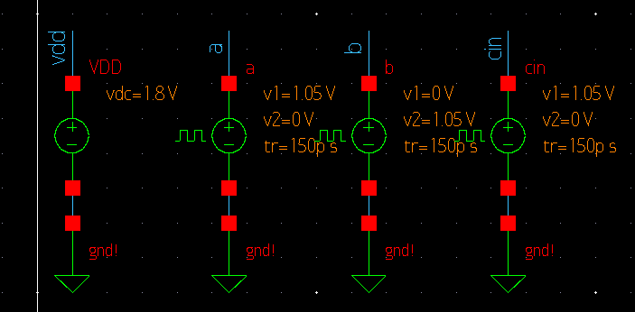
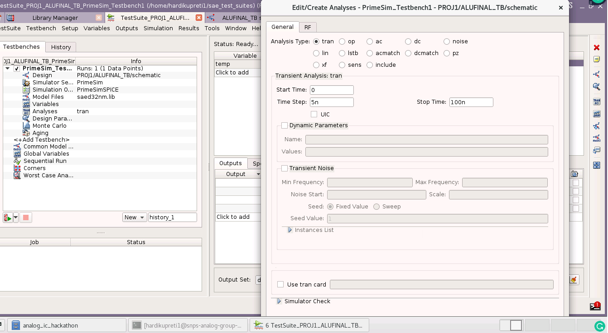
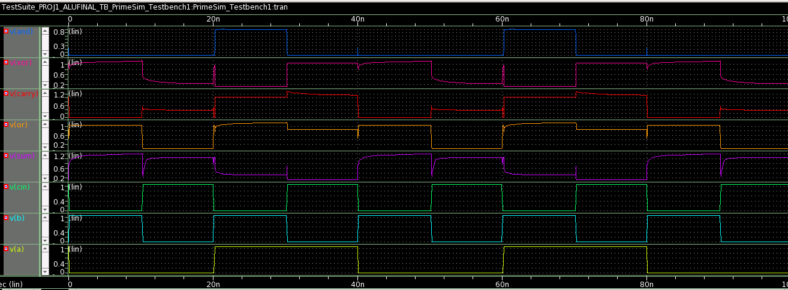

# 1-Bit-ALU-based-on-Pass-Transistor-Logic-28 nm

This repository presents the design of a 1 Bit ALU designed using Pass Transistor Logic. A 10T design has been implemented using Synopsis Custom Compiler on 28nm CMOS Technology.

# Table of Contents
   * [Abstract](#abstract)
  * [Reference Circuit Details](#reference-circuit-details)
  * [Reference Circuit Diagram](#reference-circuit-diagram)
  * [Reference Waveform](#reference-circuit-waveform)
- [Simulation in Synopsys Custom Compiler](#simulation-in-synopsys)
  * [Schematic](#schematic)
  * [Symbol](#symbol)
  * [Testbench](#Testbench)
  * [Parameters for Input Voltage Sources and Power Supply](#Parameters-for-Input-Voltage-Sources-and-Power-Supply)
  * [Transient Settings](#transient-settings)
  * [Netlist](#netlist)
  * [Waveform](#waveform)
  * [Conclusion](#conclusion)
  * [Acknowledgement](#acknowlegement)
  * [References](#references)


## Abstract

A Pass Transistor Logic-based 1 Bit 
ALU has been presented consisting of 10T. Reuse of adder
hardware has been done to reduce the count of transistors for 
implementing the circuit. A Low power 6T-based 1 Bit Full 
Adder circuit has been designed and XOR operation has been 
derived from the same hardware. AND, OR have been implemented separately. The reference paper has utilized 65 nm 
CMOS technology helps to attain lower Power and Area consumption[1].

## Reference Circuit Details

A. 1 Bit Full Adder Circuit

In the design, Pass Transistor-based MUX are fed with 
XOR of a and b to select the output to be obtained from the 
Sum and the Carry pins.

The circuit of the Full Adder is shown below:
<p align="center">
</br>
  Fig. 1: 1 Bit Full Adder Reference Circuit [2]
</p>


## Reference Circuit Diagram
The circuit schematic of the ALU is shown below
<p align="center">
</br>
  Fig. 2: Reference ALU Circuit [1]
</p>

## Reference Circuit Waveform
<p align="center">
</br>
  Fig. 3: Reference Waveform [1]
</p>

# Simulation in Synopsys Custom Compiler
## ALU Schematic
<p align="center">
</br>
  Fig. 4: ALU Schematic using Pass Transistor Logic
</p>

#Note :  In [1] the Design which has been referred is based on 65 nm technology. Here, I have implemented the OR Gate in a different manner so as to make the output waveform more accurate for 28 nm. Rest of the circuit is same as given in [1].

## Symbol
<p align="center">
</br>
  Fig. 5: ALU Symbol 
</p>

## Testbench
<p align="center">
</br>
  Fig. 6: Testbench for ALU 
</p>

## Parameters for Input Voltage Sources and Power Supply
<p align="center">
</br>
  Fig. 7: DC VDD and Pulse Voltage Inputs 
</p>


## Transient Settings
<p align="center">
</br>
  Fig. 8: The Transient Analysis inputs Run at 5ns step with stop time 100ns 
</p>

## Netlist
```
*  Generated for: PrimeSim
*  Design library name: PROJ1
*  Design cell name: ALUFINAL_TB
*  Design view name: schematic
.lib 'saed32nm.lib' TT

*Custom Compiler Version S-2021.09
*Sat Feb 26 19:06:18 2022

.global gnd!
********************************************************************************
* Library          : PROJ1
* Cell             : ALUFINAL
* View             : schematic
* View Search List : hspice hspiceD schematic spice veriloga
* View Stop List   : hspice hspiceD
********************************************************************************
.subckt alufinal and carry or sum xor a a_ b cin cin_ vdd
xm19 or a vdd gnd! n105 w=0.1u l=0.03u nf=1 m=1
xm6 or a_ b gnd! n105 w=0.2u l=0.03u nf=1 m=1
xm5 and a_ gnd! gnd! n105 w=0.1u l=0.03u nf=1 m=1
xm18 sum xor cin_ gnd! n105 w=0.1u l=0.03u nf=1 m=1
xm2 carry xor cin gnd! n105 w=0.1u l=0.03u nf=1 m=1
xm1 xor b a_ gnd! n105 w=0.1u l=0.03u nf=1 m=1
xm4 and a b gnd! n105 w=0.1u l=0.03u nf=1 m=1
xm9 sum xor cin vdd p105 w=0.1u l=0.03u nf=1 m=1
xm8 carry xor a vdd p105 w=0.1u l=0.03u nf=1 m=1
xm7 xor b a vdd p105 w=0.1u l=0.03u nf=1 m=1
.ends alufinal

********************************************************************************
* Library          : PROJ1
* Cell             : inverter
* View             : schematic
* View Search List : hspice hspiceD schematic spice veriloga
* View Stop List   : hspice hspiceD
********************************************************************************
.subckt inverter gnd_1 vdd vin vout
xm0 vout vin gnd_1 gnd_1 n105 w=0.1u l=0.03u nf=1 m=1
xm1 vout vin vdd vdd p105 w=0.1u l=0.03u nf=1 m=1
.ends inverter

********************************************************************************
* Library          : PROJ1
* Cell             : ALUFINAL_TB
* View             : schematic
* View Search List : hspice hspiceD schematic spice veriloga
* View Stop List   : hspice hspiceD
********************************************************************************
xi0 and carry or sum xor a a_ b cin cin_ vdd alufinal
vdd vdd gnd! dc=1.8
vcin cin gnd! dc=0 pulse ( 1.05 0 0 150p 150p 10n 20n )
vb b gnd! dc=0 pulse ( 0 1.05 0 150p 150p 10n 20n )
va a gnd! dc=0 pulse ( 1.05 0 0 150p 150p 20n 40n )
xi10 gnd! vdd cin cin_ inverter
xi9 gnd! vdd a a_ inverter


.tran '5n' '100n' name=tran

.option primesim_remove_probe_prefix = 0
.probe v(*) i(*) level=1
.probe tran v(and) v(carry) v(or) v(sum) v(xor) v(a) v(b) v(cin)

.temp 25


.option primesim_output=wdf


.option parhier = LOCAL


.end

```
## Waveform

<p align="center">
</br>
  Fig. 9: ALU Waveform 
</p>

## Conclusion
A 1 Bit ALU has been designed on the Synopsys Custom Compiler and the waveform has been obtained. The use of Pass Transistor Logic helps to greatly bring down the number of transistors to 10 transistors. Also, due to less number of transistors, the Area, as well as the power consumption of this design, is less as compared to the earlier designs of ALU which have more transistors.

## Acknowledgement
1. Kunal Ghosh, Co-founder, VSD Corp. Pvt. Ltd. - kunalpghosh@gmail.com
2. Chinmay panda, IIT Hyderabad
3. Sameer Durgoji, NIT Karnataka
## References
[1]. G. Karthik Reddy, Kavita Khare, " Low power-area 
designs of 1-bit full adder in cadence virtuoso platform," 
International Journal of VLSI design & Communication 
Systems (VLSICS) VolA, NoA, August 2013.

[2]. G. K. Reddy, "Low power-area Pass Transistor Logic 
based ALU design using low power full adder design," 2015 
IEEE 9th International Conference on Intelligent Systems and 
Control (ISCO), 2015,
